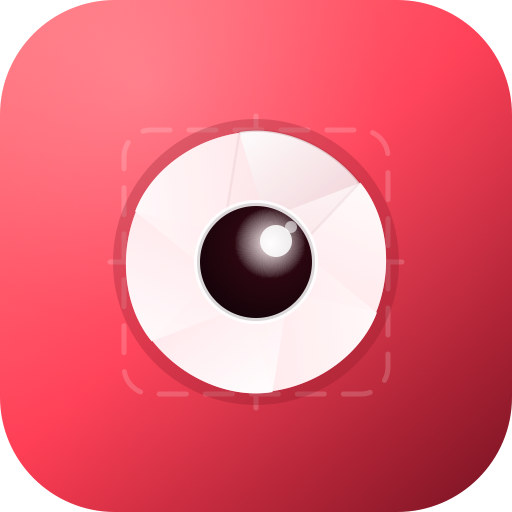

<p align="center">
  
</p>

# Screenshot Ultra

A snappy, hotkey-first macOS screenshot and screen recorder. Press a key, capture anything on screen — region, window, fullscreen, or clipboard image — annotate it inline with eleven tools, and it's on your clipboard before the shutter sound finishes. Built in Rust + native AppKit, runs entirely on your machine, no telemetry, no cloud account, no auto-upload.

[](https://github.com/MPJHorner/ScreenshotUltra/actions/workflows/ci.yml)
[](https://github.com/MPJHorner/ScreenshotUltra/releases/latest)
[](https://mpjhorner.github.io/ScreenshotUltra/)
[](LICENSE)
[](https://www.rust-lang.org)
[](https://github.com/MPJHorner/ScreenshotUltra/releases/latest)

> **Full documentation: [mpjhorner.github.io/ScreenshotUltra](https://mpjhorner.github.io/ScreenshotUltra/)** · [Install](https://mpjhorner.github.io/ScreenshotUltra/install/) · [Quick start](https://mpjhorner.github.io/ScreenshotUltra/quick-start/) · [Hotkeys](https://mpjhorner.github.io/ScreenshotUltra/hotkeys/) · [Editor](https://mpjhorner.github.io/ScreenshotUltra/editor/) · [Changelog](https://mpjhorner.github.io/ScreenshotUltra/changelog/)

## Why

macOS's built-in screenshot tool is great until you need to annotate, pin, repeat, or pipe the result somewhere. CleanShot X and friends solve that — for a yearly subscription and a cloud account you didn't ask for. Screenshot Ultra is the local Mac alternative: every capture lives on your disk in a folder you choose, the annotation editor is a real `NSWindow` (not a Chromium tab), and the optional "share to anywhere" sink is a shell command you write, so you keep total control over where pixels go.

## Install

> ### 🚀 macOS — one line
>
> ```sh
> curl -sSL https://raw.githubusercontent.com/MPJHorner/ScreenshotUltra/main/scripts/install.sh | bash
> ```
>
> Detects your arch, grabs the universal `.zip` from the [latest release](https://github.com/MPJHorner/ScreenshotUltra/releases/latest), verifies the SHA-256, drops `Screenshot Ultra.app` into `/Applications`, and clears the Gatekeeper quarantine flag. That's it — open it from Spotlight or `open "/Applications/Screenshot Ultra.app"` and grant Screen Recording permission on first launch.

Prefer the manual route? Download the `.zip` from the [latest release](https://github.com/MPJHorner/ScreenshotUltra/releases/latest), unzip it into `/Applications`, then `xattr -dr com.apple.quarantine "/Applications/Screenshot Ultra.app"`. Build-from-source instructions are on the [install page](https://mpjhorner.github.io/ScreenshotUltra/install/).

## Quick start

Launch the app — a small camera icon appears in your menu bar, no dock icon. Then:

```
⌃⌥⌘1   →  drag a rectangle              → image on clipboard, saved to disk, Quick Tray bottom-right
⌃⌥⌘2   →  hover-highlight, click window → same flow, pixel-tight crop
⌃⌥⌘3   →  capture the main display       → same flow
⌃⌥⌘E   →  paste a clipboard image        → run it through the same flow
⌃⌥⌘R   →  repeat the last capture        → same mode, same destinations
⌃⌥⌘.   →  pin the last capture           → floating, always-on-top window
```

Every binding is rebindable in `~/Library/Application Support/ScreenshotUltra/settings.toml` and changes take effect within a second — no app restart.

## What it does

- **Captures** — region, window, fullscreen (main display or all displays), timed (3 / 5 / 10 s countdown via `⌃⌥⌘1`+the tray menu), clipboard image → editor.
- **Quick Tray** — a native floating `NSWindow` that pops up bottom-right after every capture: thumbnail + **Copy / Edit / Folder / Reveal / Pin / Discard** buttons. Auto-dismisses after 6 s. Has a silent counterpart for the snappiest possible flow.
- **Native annotation editor** — eleven tools (Pen / Line / Arrow / Rect / Ellipse / Highlighter / Redact / Counter / Text / Blur / Crop), five-colour palette, three-step stroke-width picker, full undo/redo. `⌘S` saves the annotated PNG over the original, `⌘C` copies it to the clipboard.
- **Pin-to-screen** — always-on-top floating window holding the latest capture. Cascade multiple pins; close with `⌘W`.
- **Sinks** — clipboard, disk, and an arbitrary shell command (`scp` / `rclone` / `slack-upload` / whatever) with the path as `$1`. Runs detached so slow uploaders never stall capture.
- **Logging** — one JSON line per event in `~/Library/Logs/ScreenshotUltra/log.ndjson`, plus a per-folder history index at `<save_folder>/.screenshot-ultra/index.ndjson`. Grep, `jq`, `tail -f` — your call.
- **No network code links into the binary by default**. Open Little Snitch; it'll never light up.

## Hotkeys

| Action                       | Default | Notes                                       |
|------------------------------|---------|---------------------------------------------|
| Region capture               | `⌃⌥⌘1`  | Drag to define; `Esc` cancels               |
| Window capture               | `⌃⌥⌘2`  | Hover-highlight; click to capture           |
| Fullscreen capture           | `⌃⌥⌘3`  | Main display, all displays, or per-display  |
| Open clipboard image         | `⌃⌥⌘E`  | Pastes a clipboard image into the same flow |
| Repeat last                  | `⌃⌥⌘R`  | Re-runs the previous mode                   |
| Pin last to screen           | `⌃⌥⌘.`  | Floating always-on-top window               |
| Colour picker (eyedropper)   | `⌃⌥⌘P`  | Copies the picked `#rrggbb` to clipboard    |
| Preferences                  | `⌃⌥⌘,`  | In-app `settings.toml` editor               |
| Cheat Sheet                  | `⌃⌥⌘/`  | All hotkeys + editor shortcuts in one window |
| Record video (toggle)        | `⌃⌥⌘V`  | Start/stop a screen recording (`.mov`)      |
| Record GIF (toggle)          | `⌃⌥⌘G`  | Same flow, post-processed to `.gif` via `ffmpeg` |
| Silent variants              | _unset_ | Set `silent_*` in `settings.toml` to enable |

All bindings live under `[hotkeys]` in `settings.toml`. Full syntax reference on the [hotkeys docs page](https://mpjhorner.github.io/ScreenshotUltra/hotkeys/).

## Editor shortcuts

| Key | Tool        |  Key | Tool        |  Key | Action       |
|-----|-------------|------|-------------|------|--------------|
| `P` | Pen         | `H`  | Highlighter | `⌘S` | Save         |
| `L` | Line        | `X`  | Redact      | `⌘C` | Copy         |
| `A` | Arrow       | `N`  | Counter     | `⌘Z` | Undo         |
| `R` | Rectangle   | `T`  | Text        | `⌘⇧Z`| Redo         |
| `E` | Ellipse     | `B`  | Blur        | `⌘W` | Close editor |
| `C` | Crop        | `1`–`3`| Stroke width                |  |  |

The full editor reference — every tool, every shortcut, how saving renders into the original resolution — lives at [mpjhorner.github.io/ScreenshotUltra/editor/](https://mpjhorner.github.io/ScreenshotUltra/editor/).

## Configuration

`~/Library/Application Support/ScreenshotUltra/settings.toml` is auto-created on first run. Edits are picked up within ~1 second (no restart). Invalid hotkeys keep the previous binding so you can't lock yourself out.

```toml
[general]
save_folder            = "~/Pictures/ScreenshotUltra"
filename_template      = "{date}_{time}_{mode}_{seq}"
default_image_format   = "png"
copy_on_capture        = true
play_shutter_sound     = true
quick_tray_timeout_ms  = 6000

[capture]
include_cursor         = false
fullscreen_scope       = "main"           # main | all

[hotkeys]
region                 = "ctrl+alt+cmd+1"
window                 = "ctrl+alt+cmd+2"
fullscreen             = "ctrl+alt+cmd+3"
open_clipboard_image   = "ctrl+alt+cmd+e"
pin_last               = "ctrl+alt+cmd+period"
repeat_last            = "ctrl+alt+cmd+r"

[sinks]
clipboard              = true
disk                   = true
shell                  = ""               # e.g. "scp $1 user@host:/var/www/img/"
```

Print the resolved path with `screenshot-ultra --settings-path`. Regenerate the defaults with `screenshot-ultra --print-defaults > settings.toml`.

## Sinks & shell

```toml
[sinks]
shell = "rclone copy $1 s3:my-bucket/screenshots/"
# or
shell = "scp $1 user@host:/var/www/img/"
# or
shell = "/usr/local/bin/upload-shot $1"     # write your own; pbcopy the resulting URL
```

The shell-sink runs `/bin/sh -c "<your command>" -- <path>` detached, so a slow uploader never blocks the capture pipeline. We don't ship a built-in cloud uploader on purpose: the shell sink + a five-line script gives you every cloud, every storage backend, every team-Slack-bot you could want, without us touching your traffic.

## Development

```sh
# Iterate without a bundle (logs to stderr; useful during debugging)
make run

# Build a release .app bundle
make app
open "dist/Screenshot Ultra.app"

# Pre-commit gate: fmt + clippy + tests
make check

# Manual test plan for release sign-off
$EDITOR tests/MANUAL.md
```

CI runs `cargo fmt --check`, `cargo clippy --all-targets -- -D warnings`, `cargo test`, and a release `.app` build on every push. Tags `v*.*.*` fan out to the [Release workflow](.github/workflows/release.yml) which builds a universal (arm64 + x86_64) binary, `lipo`s them together, and attaches the `.zip` + SHA-256 to a GitHub release. The docs site rebuilds on every push to `main`.

## Documentation

The [docs site](https://mpjhorner.github.io/ScreenshotUltra/) is the canonical user-facing reference:

- **[Install](https://mpjhorner.github.io/ScreenshotUltra/install/)** — `.zip`, manual, build-from-source, Gatekeeper, permissions
- **[Quick start](https://mpjhorner.github.io/ScreenshotUltra/quick-start/)** — first capture in 30 seconds
- **[Hotkeys](https://mpjhorner.github.io/ScreenshotUltra/hotkeys/)** — every binding, every key, hot-reload semantics
- **[Capture modes](https://mpjhorner.github.io/ScreenshotUltra/capture/)** — region / window / fullscreen / timed / clipboard / repeat / pin
- **[Annotation editor](https://mpjhorner.github.io/ScreenshotUltra/editor/)** — eleven tools, colour palette, width picker, save semantics
- **[Sinks & shell](https://mpjhorner.github.io/ScreenshotUltra/sinks/)** — clipboard / disk / arbitrary shell command
- **[Configuration](https://mpjhorner.github.io/ScreenshotUltra/configuration/)** — every `settings.toml` field
- **[Logging](https://mpjhorner.github.io/ScreenshotUltra/logging/)** — NDJSON event schema, every `evt` type, `jq` recipes
- **[Changelog](https://mpjhorner.github.io/ScreenshotUltra/changelog/)** — every release

In-repo:
- **[plan.md](plan.md)** — the implementation plan and design intent
- **[docs/milestones/](docs/milestones/)** — per-milestone delivery tracking
- **[tests/MANUAL.md](tests/MANUAL.md)** — manual test checklist for release sign-off

## Sister projects

Part of the **Ultra** family of local-first developer tools:

- **[MailBox Ultra](https://github.com/MPJHorner/MailboxUltra)** — local SMTP fake inbox with native WebKit HTML preview.
- **[Postbin Ultra](https://github.com/MPJHorner/PostbinUltra)** — local HTTP request inspector with JSON tree view, forward + replay.
- **[IDE Ultra](https://github.com/MPJHorner/IdeUltra)** — local-first native code IDE in pure Rust + egui.

Same posture across all four: native, snappy, local-first, no telemetry, MIT.

## Contributing

Issues and pull requests welcome. `make check` before submitting; if you're adding a capture mode or an editor tool, add a unit test alongside (filename templating, shape geometry, settings parsing — all have working examples in `src/`).

## License

[MIT](LICENSE) © 2026 Matt Horner.
